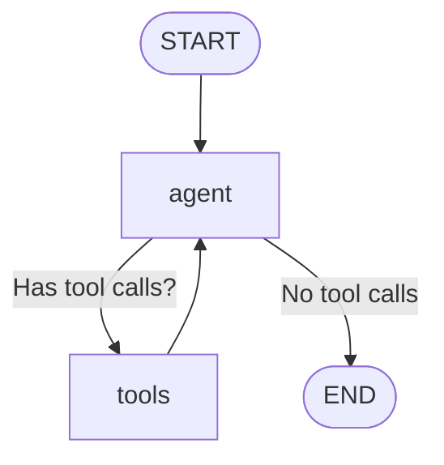
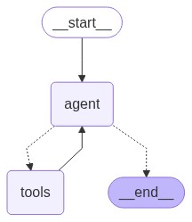

# 🧙‍♂️ LangGraph Agent Workshop: Where Code Meets Magic!

Welcome to Lab 2, where we'll transform your computer from a boring machine into an AI-powered oracle that can tell you both the time AND the weather! (Yes, we're basically wizards now.)

> "Give a programmer a tool, and they'll solve one problem. Teach a programmer LangGraph, and they'll build an AI agent to solve their problems while they drink coffee." — Ancient Developer Proverb (circa 2023)

## 🚀 What's in the Cauldron?

This magical repository contains a LangGraph agent with superpowers:
- **Time Bending**: Can tell you the current time in any timezone (no DeLorean required)
- **Weather Divination**: Can predict current weather conditions (more reliable than your local meteorologist)
- **Mathematical Wizardry**: Comes with a calculator tool for when math gets hard
- **Knowledge Seeking**: Uses Tavily search to find answers to your deepest questions

## 📚 Table of Contents (Because Organization is Magic Too)

- [🚀 Quick Setup](#-quick-setup)
- [🔑 Secret Spells (API Keys)](#-secret-spells-api-keys)
- [🛠️ Crafting Your Agent](#-crafting-your-agent)
- [🧪 Potion Ingredients (Code Regions)](#-potion-ingredients-code-regions)
- [🏃‍♂️ Running the Experiment](#-running-the-experiment)
- [🧙‍♀️ The Magic Flow (Mermaid Diagram)](#-the-magic-flow-mermaid-diagram)

## 🚀 Quick Setup

To summon this agent to your machine, perform this incantation:

```bash
npm install  # Gather the magical dependencies
```

## 🔑 Secret Spells (API Keys & Environment Variables)

Our agent requires magical tokens to unlock its full potential. By default, you'll need:

- 🔍 [Tavily API Key](https://tavily.com/) - For web search capabilities
- 🤖 [OpenAI API Key](https://platform.openai.com/signup) - For the AI brain (if using OpenAI)

Create a `.env` file in your magic circle (this directory) and add your chosen configuration.

### 📜 Summoning Different LLM Models

Our grimoire supports multiple AI models through the `LlmProviderManager`. You can easily switch between them by configuring the appropriate environment variables:

#### 🧙‍♂️ GitHub Copilot (Default)

```bash
# GitHub Copilot Configuration
GITHUB_MODEL_NAME=gpt-4o-mini  # Or your preferred model
GITHUB_TEMPERATURE=0.9  # Higher is more creative, lower is more predictable
GITHUB_OPENAI_API_KEY=your_github_api_key  # Your GitHub Copilot API key
```

#### 🔮 OpenAI

```bash
# OpenAI Configuration
OPENAI_MODEL_NAME=gpt-4-turbo  # Or another model like gpt-3.5-turbo
OPENAI_TEMPERATURE=0.7  # Adjust for creativity/predictability
OPENAI_API_KEY=your_openai_api_key  # Get this from platform.openai.com
```

#### 🧪 Ollama (For Local Models)

```bash
# Ollama Configuration (for local deployment)
OLLAMA_MODEL_NAME=llama3.2:latest   # Or any model you've pulled to Ollama
OLLAMA_TEMPERATURE=0.8  # Adjust as needed
OLLAMA_BASE_URL=http://localhost:11434  # Default Ollama URL
```

#### ☁️ Azure OpenAI

```bash
# Azure OpenAI Configuration
AZURE_OPENAI_API_KEY=your_azure_api_key
AZURE_OPENAI_ENDPOINT=your_azure_endpoint  # Something like https://your-resource.openai.azure.com/
AZURE_OPENAI_API_DEPLOYMENT_NAME=your_deployment_name  # The name you gave your deployed model
AZURE_OPENAI_MODEL_NAME=gpt-4  # The underlying model name
AZURE_OPENAI_TEMPERATURE=0.7  # Adjust as needed
```

#### 🔄 Switching Between Models

To change which model your agent uses, update the following line in `index.ts`:

```typescript
const model = await LlmProviderManager.getLlmProvider(LlmProvider.Github);
```

Change `LlmProvider.Github` to one of:
- `LlmProvider.OpenAI`
- `LlmProvider.Ollama`
- `LlmProvider.Azure`
- `LlmProvider.Anthropic`
- `LlmProvider.Bedrock`

And ensure you've set up the corresponding environment variables.

#### ✨ Obtaining API Keys

**For GitHub Copilot**: 
- If you have access to GitHub Copilot already, contact your administrator for API access
- The API key format differs from standard OpenAI keys

**For OpenAI**:
- Sign up at [platform.openai.com](https://platform.openai.com/signup)
- Navigate to API Keys section
- Create a new secret key and copy it immediately

**For Azure OpenAI**:
- Create an Azure account if you don't have one
- Apply for Azure OpenAI access
- Create an Azure OpenAI resource
- Deploy your chosen models in the Azure OpenAI Studio
- Get your endpoint and keys from the Azure portal

**For Ollama**:
- [Install Ollama](https://ollama.ai/download) on your machine
- Pull models with `ollama pull modelname`
- No API key needed as it runs locally!

### 🧩 LangGraph Configuration

The sacred configuration scroll is located at [`langgraph.json`](langgraph.json). It defines our agent's true name and purpose.

### 🔍 Obtaining Your Tavily Crystal Ball

1. **Join the Order of Tavily**
   - Visit the [Tavily temple](https://tavily.com/) and pledge your allegiance (create an account)
   - Verify your email to complete the ritual

2. **Access the Sacred Dashboard**
   - Navigate to the **Dashboard** chamber
   - Here you'll find your usage stats and configuration options

3. **Summon Your API Key**
   - Find the **API Keys** section
   - Click **Generate API Key** to forge your unique key
   - Copy this key and guard it well! It contains great power!

## 🛠️ Crafting Your Agent

To modify your agent's abilities, open the magical grimoire (`index.ts`) and alter the runes as needed.

## 🧪 Potion Ingredients (Code Regions)

Our agent is crafted from several mystical components:

### 1. 🪄 Model (The Brain)

```typescript
//#region model
import {
  LlmProviderManager,
  LlmProvider,
} from "./LlmProviderManager/LlmProviderManager.js";

const model = await LlmProviderManager.getLlmProvider(LlmProvider.Github);
//#endregion model
```

This component summons a powerful AI from GitHub to serve as the agent's mind.

### 2. 🧰 Tools (The Powers)

```typescript
//#region tools

const webSearchTool = new TavilySearch({
  maxResults: 4,
});

const todayDateTimeSchema = z.object({
  timeZone: z.string().describe("Time Zone Format"),
  locale: z.string().describe("Locale string"),
});

function getTodayDateTime({
  timeZone,
  locale,
}: {
  timeZone: string;
  locale: string;
}) {
  //const timeZone = 'America/Chicago';
  //const locale = 'en-US';
  console.log("Getting today's date and time in " + timeZone + " timezone");
  const today = new Date();
  const formattedDate = today.toLocaleString(locale, {
    timeZone: timeZone,
    year: "numeric",
    month: "long",
    day: "numeric",
    weekday: "long",
    hour: "2-digit",
    minute: "2-digit",
    second: "2-digit",
    hour12: true,
  });
  const result = {
    formattedDate: formattedDate,
    timezone: timeZone,
  };
  console.log(result);
  return JSON.stringify(result);
}

const dateTool = tool(
  ({ timeZone, locale }) => {
    return getTodayDateTime({ timeZone, locale });
  },
  {
    name: "todays_date_time",
    description: "Useful to get current day, date and time.",
    schema: todayDateTimeSchema,
  },
);

//console.log(await dateTool.invoke({timeZone: 'America/New_York', locale: 'en-US'}));

const calculator = new Calculator();
const tools = [dateTool, calculator, webSearchTool];
const toolNode = new ToolNode(tools);
//#endregion
```

Our agent wields three powerful artifacts:
- A **Time Gazer** that reveals the current time in any realm (timezone)
- A **Calculator** for solving mathematical mysteries
- A **Web Search** tool that can traverse the vast knowledge of the internet

### 3. 🧠 Logic and Nodes (The Decision-Making)

```typescript

//#region workflow
const callModel = async (state: typeof MessagesAnnotation.State) => {
  const { messages } = state;
  // Ensure model is defined and has bindTools method
  if (!model || typeof model.bindTools !== "function") {
    throw new Error(
      "Model is not properly initialized or does not support tool binding",
    );
  }
  const llmWithTools = model.bindTools(tools);
  const result = await llmWithTools.invoke(messages);
  return { messages: [result] };
};

const shouldContinue = (state: typeof MessagesAnnotation.State) => {
  const { messages } = state;
  const lastMessage = messages[messages.length - 1];
  if (
    lastMessage.getType() !== "ai" ||
    !(lastMessage as AIMessage).tool_calls?.length
  ) {
    return END;
  }
  return "tools";
};

// ...workflow definition...
//#endregion workflow
```

This is where our agent decides whether to use tools or respond with its accumulated knowledge.

### 4. 🗺️ Workflow (The Journey Map)

```typescript
const workflow = new StateGraph(MessagesAnnotation)
  .addNode("agent", callModel)
  .addNode("tools", toolNode)
  .addEdge(START, "agent")
  .addEdge("tools", "agent")
  .addConditionalEdges("agent", shouldContinue, ["tools", END]);

export const graph = workflow.compile({
  // Memory saver for local execution and state persistence
  checkpointer: new MemorySaver(),
});
graph.name = graph.name ?? "default_graph";
```

This magical map guides our agent through decision trees, telling it when to think, when to use tools, and when to respond.

### 5. 🚀 Execution (The Spell Casting)

```typescript
//#region execution
// Create main function to execute the code
import MermaidGraph from "./MermaidGraph/MermaidGraph.js";
async function main() {
  try {
    // Draw the agent graph
    graph.name = "agent";
    await MermaidGraph.drawMermaidAsImage(graph);

    const config = { configurable: { thread_id: "1", userId: "1" } };
    const agentFinalState = await graph.invoke(
      {
        messages: [
          new HumanMessage("what is the current time and weather in Dallas?"),
        ],
      },
      config,
    );

    console.log(
      //agentFinalState.messages
      agentFinalState.messages[agentFinalState.messages.length - 1].content,
    );

    const agentNextState = await graph.invoke(
      { messages: [new HumanMessage("what about San Diego?")] },
      config,
    );

    console.log(
      agentNextState.messages[agentNextState.messages.length - 1].content,
    );
  } catch (error) {
    console.error("An error occurred:", error);
  }
}

// Call the main function
main().catch((error) => console.error("Error in main:", error));
//#endregion execution
```

Here we activate our agent and command it to answer questions about weather and time in different locations.

## 🏃‍♂️ Running the Experiment

To bring your agent to life, perform this sequence of spells:

```bash
npm install  # Prepare the ingredients
npm run build  # Mix the potion
npm run start  # Speak the incantation
```

## 🧙‍♀️ The Magic Flow (Mermaid Diagram)

Behold! The visualization of our agent's thought process:



This diagram shows how our agent thinks (the "agent" node), decides whether to use tools, and when to provide a final answer.



## 🏰 Architecture Explanation: How the Magic Works

Our LangGraph agent operates through a carefully orchestrated cycle of thinking and acting:

### 🧩 Components and their Magical Properties

1. **Agent Node (The Brain)**: 
   - This is where all the thinking happens
   - The LLM processes input, decides what tools to use, and generates responses
   - Receives input from the user and feedback from tool executions

2. **Tools Node (The Hands)**:
   - Contains three magical tools: Time Divination, Calculator, and Web Search
   - Each tool serves a specific purpose and extends the agent's capabilities
   - Tools execute tasks and return results back to the agent node

3. **State Management (The Memory)**:
   - Uses `MessagesAnnotation` to keep track of conversation history
   - The `MemorySaver` checkpointer stores state between interactions
   - Enables contextual awareness across multiple user questions

### 🔄 The Flow of Magic

The workflow follows these mystical steps:

1. User query enters the system ("What's the weather in Dallas?")
2. The START node activates the agent node
3. The agent decides if it needs tools:
   - If YES: Calls the appropriate tool(s) with necessary parameters
   - If NO: Provides a direct answer and terminates at END
4. When tools are used, results flow back to the agent
5. Agent synthesizes tool results into a coherent response
6. If the response is complete, the flow reaches END

### 🔮 Decision Logic

The secret sauce of our agent is the `shouldContinue` function that determines whether:
- To use tools (when the agent's response contains tool calls)
- To terminate and provide a final answer (when no more tools are needed)

This architecture creates a powerful yet flexible system that can handle complex queries by breaking them down into tool-specific sub-tasks.

---

## 💡 Troubleshooting Common Enchantment Issues

| Issue | Magical Solution |
|-------|-----------------|
| `Error: Authorization failed` | Your API key is invalid or missing. Double-check your `.env` file and ensure the proper environment variable is set. |
| `Error: Missing token` | You forgot to include your API key in the `.env` file. |
| `Error: Region is missing` | For AWS Bedrock, make sure you've specified the AWS_REGION. |
| `Ollama connection refused` | Ensure Ollama is running locally with `ollama serve`. |
| `Azure: Resource not found` | Verify your deployment name and endpoint in Azure portal. |
| `The model '...' does not exist` | Check that you've specified a valid model name for your provider. |

## 🧙‍♂️ LLM Provider Selection Guide

| Provider | Best For | Pros | Cons |
|----------|----------|------|------|
| GitHub | Development tasks | Latest models, excellent coding | Requires GitHub Copilot access |
| OpenAI | General purpose | Reliable, widely supported | Cost, requires internet |
| Ollama | Privacy, offline use | Free, local, no data sharing | Limited capabilities vs cloud models |
| Azure | Enterprise deployment | Security, compliance features | Setup complexity |
| Anthropic | Safety, longer contexts | Great for content creation | Still emerging ecosystem |
| Bedrock | AWS integration | Multiple models, enterprise security | AWS account required |

Remember, with great AI power comes great responsibility! Use your agent wisely, and may your tokens be ever in your favor! 🧙‍♂️✨